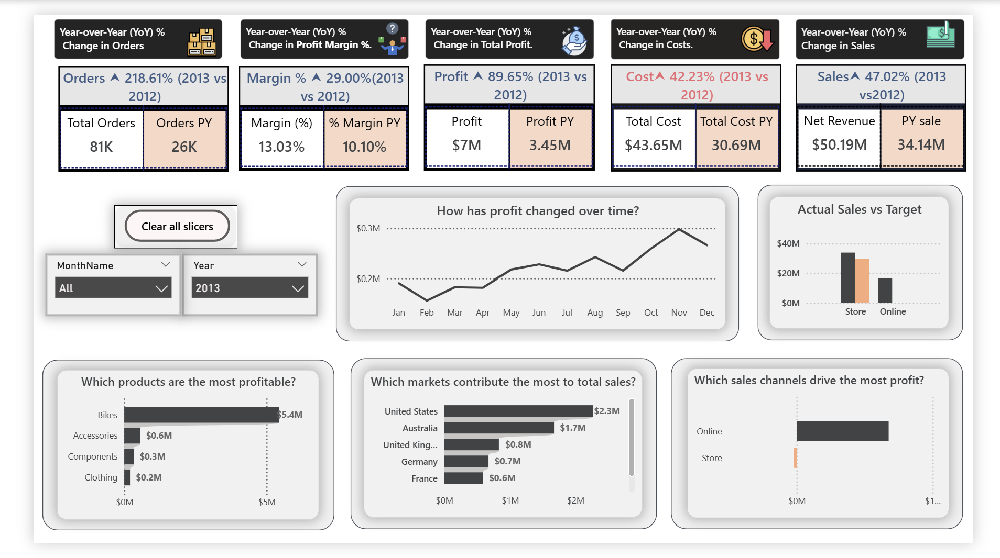
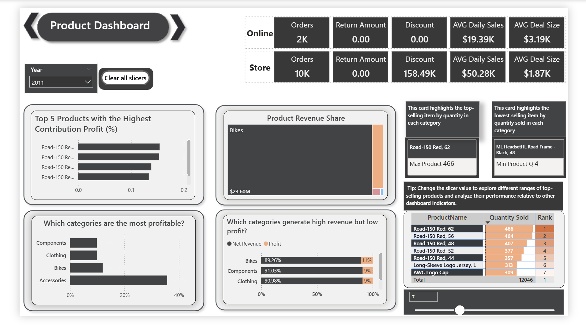
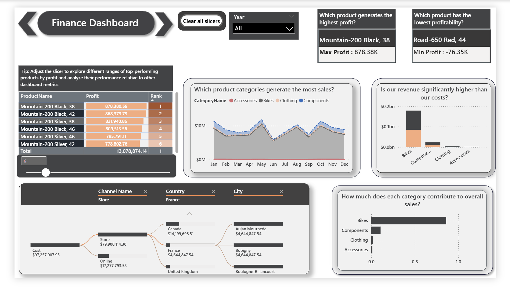
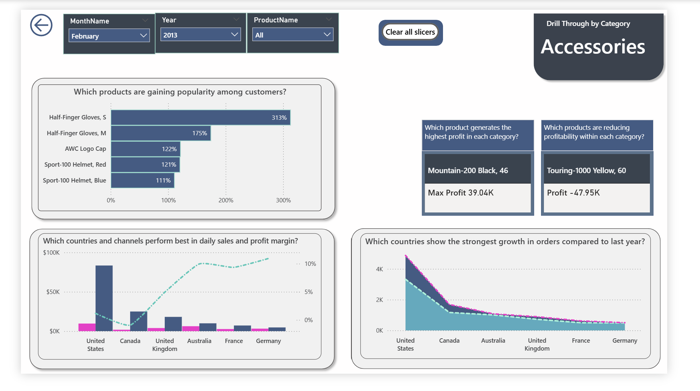
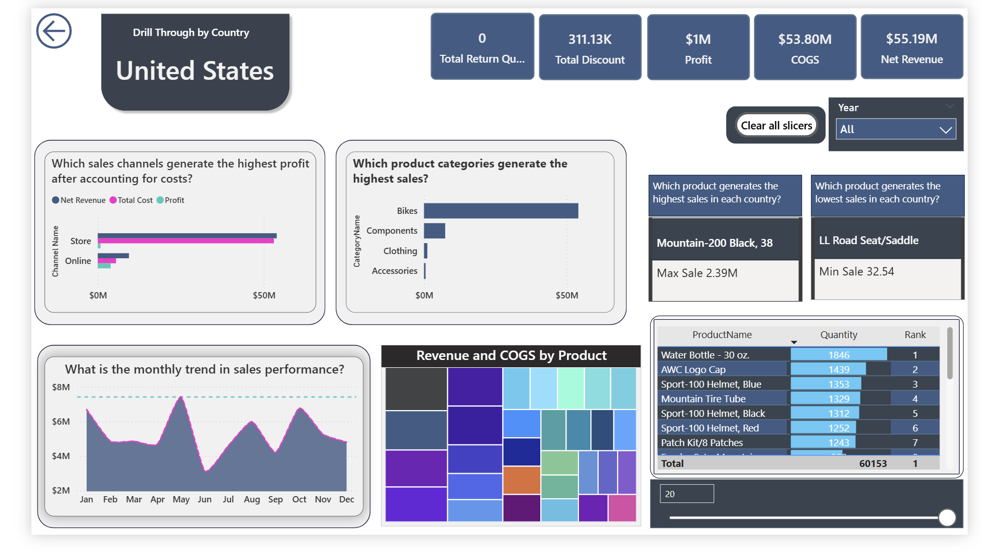
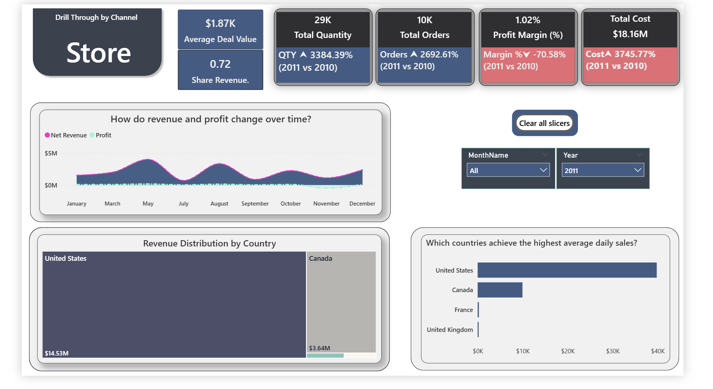

# 📊 Vizentra Sales & Profitability Dashboard

## 🚀 Project Overview
An end-to-end Business Intelligence project built with Power BI, focused on analyzing sales performance, profitability, and operational efficiency.

---

## 📊 Executive Overview

- Total Sales: $50.19M  
- Profit: $7M  
- Margin: 13%  

Key Insights:
- Sales increased by 47% YoY  
- Profit increased by 89% YoY  

---

## 🛍 Product Analysis

Insights:
- Bikes generate high revenue but low margins  
- Accessories have highest margin (~35%)

---

## 💰 Financial Analysis

Insights:
- Costs closely aligned with revenue  
- Store channel dominates cost  

---

## 📈 Sales Performance

Insights:
- Strong seasonal trends  
- High-performing products: Mountain-200  

---

## 🔍 Drill-Through Analysis
### Drill-Through Categories 

### Drill-Through Countries

### Drill-Through Channels

Users can explore:
- Countries  
- Channels  
- Categories  

---

## 🧠 Tools & Technologies
- Power BI  
- DAX  
- Data Modeling  

---

## 🎯 Business Impact
- Identified profitable products  
- Highlighted inefficiencies  
- Improved decision-making  
